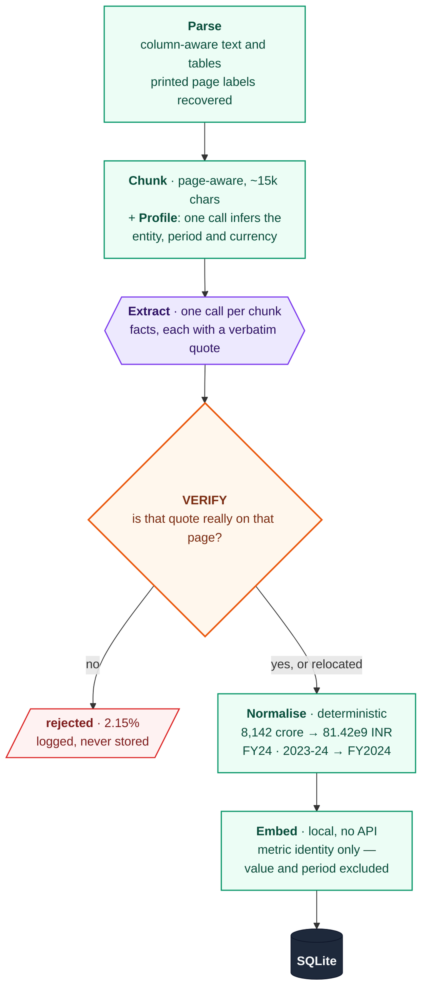
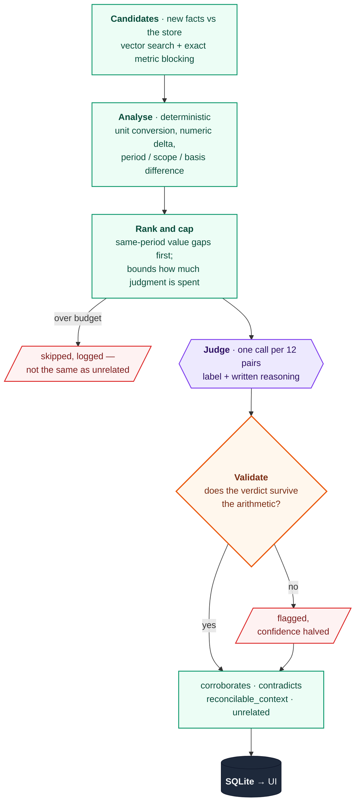

# Fact Knowledge Layer

Extracts checkable facts from PDFs, anchors every one to a verbatim quote in its
source page, and works out how facts from different documents relate: whether
they corroborate each other, genuinely conflict, or only appear to conflict
because they were measured over different periods, in different units, or at
different scopes.

Backend is FastAPI + SQLite, frontend is React + Tailwind, extraction and
reconciliation run on Google Gemini's free tier, and semantic similarity runs
locally on `sentence-transformers` so no tokens are spent finding candidates.

**On the six starter documents: 3,460 facts, every one with a located quote,
1,377 relationships, 279 API calls.**

---

### Where to look

| | |
|---|---|
| **Just run it** | [Setup](#setup-and-run-instructions) — one command, no API key needed to see results |
| **The four required cases** | [Results](#results-on-the-starter-corpus) — corroboration, contradiction, context, failure |
| **How it works** | [Architecture](#architecture) — two diagrams, then the ideas behind them |
| **Why it's built this way** | [Design decisions](#design-decisions-and-trade-offs) and [what went wrong](#things-that-went-wrong-and-what-fixed-them) |
| **What it can't do** | [Limitations](#limitations-and-next-steps) |

The first three take about five minutes. The rest is there if you want the
reasoning behind a particular decision.

---

## Setup and Run Instructions

**Requirements: Python 3.11 or newer. That is the whole list.** Node is not
needed to run this — the built frontend is committed and the backend serves it.

```bash
python run.py
```

Then open **<http://127.0.0.1:8000>**.

That one command creates the virtual environment, installs dependencies (a few
minutes the first time, mostly the CPU build of torch), copies `.env` from the
template, seeds the pre-ingested corpus, and serves the API and UI from a single
process.

**It works immediately with no API key.** A fully ingested corpus is committed
at `samples/facts.db` and copied into place on first run, so every view is
populated from the start: 6 documents, 511 pages, 3,460 facts, 1,377
relationships, and the four demonstration cases.

### To ingest your own PDFs

Extraction needs a Gemini key. The free tier is enough — the entire starter
corpus cost 279 calls.

1. Get a free key at <https://aistudio.google.com/apikey>.
2. Put it in `backend/.env`:

```
GEMINI_API_KEYS=your_key_here
```

3. Restart `python run.py`, then drag a PDF onto the **Ingest** tab.

Several keys can be listed comma-separated. They are rotated automatically and
rate-limited independently, which raises throughput; one key is fine for a
document or two.

New documents are added to the existing corpus rather than replacing it, so
uploads are immediately compared against everything already there. Start from an
empty store instead with `python run.py --fresh`.

Before a large ingest, `python backend/scripts/check_keys.py` confirms the keys
work and `python backend/scripts/plan_ingest.py <dir>` reports the call budget a
corpus needs — both cheap, and they save discovering a problem sixty calls in.

### Running the pieces separately (for development)

```bash
cd backend && python -m uvicorn app.main:app --reload --port 8000
cd frontend && npm install && npm run dev          # hot-reloading UI on :5173
```

Vite proxies `/api` to the backend, so there is nothing to configure. This is
only needed to work on the UI; `run.py` covers everything else.

### Other useful entry points

- Raw JSON of every result is in `samples/` — `showcase.json` holds the four
  required cases with their evidence and reasoning, and needs no setup at all.
- Interactive API docs at <http://127.0.0.1:8000/docs>.
- `python run.py --port 9000` to serve elsewhere, `--no-install` to skip the
  dependency check on restarts.

### Useful scripts

| Command | What it does | API calls |
|---|---|---|
| `python scripts/check_env.py` | Show loaded config and key count (never prints key values) | 0 |
| `python scripts/check_keys.py` | Probe every key against the live API | 1 per key |
| `python scripts/plan_ingest.py <dir>` | Parse and chunk a corpus, report the call budget it needs | 0 |
| `python scripts/ingest.py <dir>` | Upload and follow ingestion to completion | many |
| `python scripts/diagnose.py` | Corpus-wide quality report | 0 |
| `python scripts/peek.py facts\|relations\|issues` | Readable sample of what was extracted | 0 |
| `python scripts/debug_reject.py [n]` | Show rejected extractions beside the source text | 0 |
| `python scripts/reverify.py` | Re-check every stored quote against a fresh parse | 0 |
| `python scripts/renormalize.py [--apply]` | Re-derive comparison keys after a parser fix | 0 |
| `python scripts/revalidate.py [--apply]` | Replay the judgment consistency check | 0 |
| `python scripts/export_samples.py` | Regenerate `samples/` | 0 |
| `python -m pytest` | 140 unit tests | 0 |

---

## Video Demo

**[Demo video (3 minutes or less)](ADD_YOUR_LINK_HERE)**

Shows a PDF being ingested end to end, then each of the four required cases with
its source evidence and the system's reasoning.

---

## Results on the starter corpus

Both starter datasets were ingested into one shared knowledge layer. They cover
unrelated subject areas on purpose: the system had to keep them apart on its own
rather than being told they were separate corpora.

| | |
|---|---|
| Documents / pages | 6 / 511 |
| Facts stored | **3,460** |
| Facts with a located quote | **3,460 (100%)**: 3,413 on the cited page, 47 relocated |
| Facts rejected for unverifiable evidence | 76 (**2.15%** of everything proposed) |
| Relationships | **1,377**: 80 corroborate, 6 contradict, 834 reconcilable-by-context, 457 unrelated |
| Verdicts flagged as inconsistent | 18 (initially 50, see below) |
| LLM calls | **279** (155 extraction, 118 judgment, 6 profile) |
| Wall clock | 37 minutes on 5 free-tier keys |

Normalisation coverage: 98.6% of facts got a parsed numeric value, 92.4% a
canonical period, 100% a measurement basis.

The relation mix is worth reading carefully. Contradictions are rare (6) because
the bar is deliberately high: a difference in numbers is not a contradiction
until period, unit, scale, scope and basis have all been ruled out. Most
apparent conflicts turn out to be reconcilable, and 698 of the 834 reconcilable
pairs differ on time alone.

### The four required cases

All four are computed live from whatever is currently ingested, not hardcoded.
They are the Walkthrough tab in the UI, and `samples/showcase.json` on disk.

**1. Corroborated across documents, stated differently.** Delhivery's FY24
EBITDA appears as `₹127 Cr` in the Q4 earnings deck and `₹1,266 million` in the
annual report. Different documents, different scales, same quantity. The
normaliser converts both to 1.27e9 INR; the judge explains the conversion.

**2. A genuine or likely contradiction.** Growth in emerging markets for CY2025
is stated as `4.3%` in Delhivery's annual report and `3.7%` in the RBI annual
report. Both are projections, for the same period, about the same subject. They
cannot both be right, and they trace to different IMF forecast vintages.

**3. An apparent contradiction explained by context.** The Economic Survey
reports Kharif food-grain production growth as both `8.2%` and `5.7%` for
2024-25. Not a conflict: one is measured against the five-year average, the
other against the previous year. Labelled `reconcilable_context`, dimension
`scope`. A second example differs on `basis`: an RBI inflation projection for
FY25 appears as both `4.5%` and `4.8%` because the December 2024 MPC revised it.

**4. An extraction or reasoning failure.** Three distinct kinds, all surfaced in
the UI rather than swallowed: 76 facts rejected because their quote could not be
found in the source, 47 citations automatically repaired, and 18 verdicts
flagged where the model's label contradicted the deterministic analysis. The
"Things that went wrong" section below describes each and what fixed it.

---

## Approach

### Architecture

Two phases. The first turns one document into verified facts; the second
compares those facts against everything already stored.

Purple is an LLM call — the only step that costs quota. Green is deterministic
Python: free, auditable, and identical on every run. Orange is a gate that can
reject its input, and red is what gets thrown away and logged rather than
silently kept.

**1. Ingesting one document**



**2. Linking against everything already known**

Only the new document's facts run through this. Existing facts are already
parsed, extracted and embedded, which is what makes ingestion incremental.



### Module map

| Path | Responsibility |
|---|---|
| `app/config.py` | Every tunable in one place, env-overridable |
| `app/db.py` | SQLite access, migrations, issue and call logging |
| `app/schema.sql` | Storage model, with the reasoning for each table |
| `app/llm/keypool.py` | Key rotation, per-key rate limiting, 429 cooldowns |
| `app/llm/gemini.py` | REST client, retries, JSON repair, model circuit breaker |
| `app/llm/prompts.py` | The three prompts: profile, extract, judge |
| `app/pipeline/pdf_parse.py` | PDF to page text, column handling, page labels |
| `app/pipeline/chunking.py` | Page-aware chunking with page markers |
| `app/pipeline/extract.py` | Chunk to verified, normalised facts |
| `app/pipeline/verify.py` | Quote matching: the evidence guarantee |
| `app/pipeline/normalize.py` | Units, scales, periods, metric identity |
| `app/pipeline/embeddings.py` | Local encoder and in-memory vector index |
| `app/pipeline/linking.py` | Candidates, analysis, judgment, validation |
| `app/pipeline/ingest.py` | Orchestration, concurrency, progress, failure isolation |
| `app/pipeline/showcase.py` | The four demonstration cases, as live queries |
| `app/api/routes.py` | HTTP API |

The frontend mirrors this: `views/ShowcaseView.tsx` is the four-case
walkthrough, `views/RelationsView.tsx` the relationship browser,
`views/FactsView.tsx` the searchable fact list with an evidence drawer that
highlights the quote inside its source page, `views/IngestView.tsx` upload plus
live job progress and key-pool telemetry.

### The ideas that matter

**1. A citation is only a citation if it survives a click.** Every fact carries a
quote and a page. Before storage, the quote is searched for in the actual text
of the page it claims. Matching tolerates the whitespace and punctuation damage
that PDF extraction always produces, and nothing else. Three outcomes:
`verified` (found on the claimed page), `relocated` (found on a different page
in the same chunk, citation corrected and logged), `unverified` (**the fact is
rejected** and written to the issues table). A model that paraphrases, merges
two sentences, or invents a number does not clear this bar. There are tests
asserting that a hallucinated quote and a paraphrase both fail.

**2. Deterministic normalisation, not prompt arithmetic.** The model reads the
document; Python does the maths. `8,142` + `INR crore` becomes `81.42e9 INR`.
`FY24`, `FY 2023-24` and `2023-24` all become `FY2024`. `25 bps` becomes
`0.25 pp`. `(1,008)` becomes `-1008`. This is auditable, free, and
deterministic, and it hands the judge a finished comparison rather than asking a
language model to do arithmetic.

**3. Embed the metric, not the measurement.** The embedded text is subject,
predicate and scope qualifiers, with the value and period deliberately excluded.
This is counter-intuitive and load-bearing: if the value were embedded, two
documents that disagree would be pushed *apart* in vector space and the
disagreement would never be found. Excluding the period has a bonus: `revenue
FY2024` and `revenue FY2023` embed identically, become a candidate pair, and get
labelled reconcilable-by-time. Period markers are also stripped from metric
names, because models write `FY24 EBITDA` in one document and `EBITDA` in
another.

**4. Judgment is the scarce resource, so it is rationed by expected value.**
Candidate pairs grow roughly quadratically. On the largest document, 1,072
candidates were generated, 311 rejected by rule, the top 420 by priority judged,
and 341 skipped. `linking.priority` ranks same-period value gaps (the
contradiction signature) highest, near-misses on the same period almost as high,
then scale differences, then agreement stated in different words or units;
identically-worded agreement ranks lowest, and unverified evidence is penalised.
The skipped count is recorded as an issue: a pair that was never judged is not a
pair that was judged unrelated.

**5. The model's verdict is checked against the arithmetic.** The judge sees each
fact's evidence quote, and quotes routinely mention other years and figures. It
once called a 6.6%/2023 fact and a 5.7%/2024 fact identical because both quotes
contained "5.7 per cent in 2024". The deterministic layer only ever sees
normalised values and periods, so it cannot be misled that way. Every verdict is
cross-checked (`linking.validate_judgment`); a corroboration across different
periods, or a contradiction between an estimate and an actual, is inconsistent
by construction. Such verdicts are kept but have their confidence halved, are
marked `llm-flagged`, and are logged.

**6. Incremental by construction.** Ingesting document N never re-parses,
re-extracts or re-embeds documents 1..N-1. The only new work is this document's
extraction plus the cross-document comparisons it newly makes possible. Deleting
a document cascades to its facts, its embeddings and exactly the relations that
referenced them.

### Why the similarity threshold is 0.58

From the judged pairs, grouped by the cosine score that made them candidates:

| Similarity band | Pairs | Judged `unrelated` |
|---|---|---|
| 0.95 - 1.00 | 825 | 18.3% |
| 0.85 - 0.95 | 197 | 24.9% |
| 0.75 - 0.85 | 163 | 56.4% |
| 0.65 - 0.75 | 147 | 83.7% |
| 0.58 - 0.65 | 45 | 93.3% |

A clean monotonic curve, so the threshold is a data-backed dial rather than a
guess: raising it saves budget and costs recall. Note that even at 0.95+, 18% are
unrelated. That is the direct consequence of embedding metric identity while
excluding values and periods, and it means the judge is doing real work.

### Generalising to unseen PDFs

The following appear nowhere in the codebase: document filenames, titles or
publishers; metric names, expected facts, or per-document schemas; layout rules
keyed to a particular report.

What is imposed instead is the universal shape of a measurement (who, what, how
much, when, under what scope) plus a free-form `qualifiers` list carrying
whatever document-specific nuance exists, in the document's own words.
`fact_type` and `qualifiers` are model-authored and open-ended, which is how the
schema evolves as new kinds of facts appear.

Everything else is driven by structure, not content: character counts drive
chunking, block geometry drives column detection, regular expressions over units
and periods drive normalisation, and the four demonstration cases are queries
over live data. Ingest a corpus about shipping or pharmaceuticals and the same
queries surface that corpus's examples.

### Design decisions and trade-offs

**SQLite over Postgres.** Single-node system, working set of thousands of rows.
SQLite gives transactions, joins, foreign-key cascades and a single-file artifact
that can be committed and handed to a reviewer, at zero operational cost. The
whole corpus is 12.3 MB including 511 pages of source text and 5.3 MB of
embeddings. It would need replacing for concurrent writers or a corpus large
enough that a brute-force vector scan stops being instant.

**Brute-force vectors over a vector database.** Vectors are L2-normalised, so
cosine similarity is one NumPy dot product over 3,460 x 384. That is
sub-millisecond, faster than the network round trip to any vector service, with
none of the operational surface. The index is a class with `load`/`add`/`search`,
so swapping it is contained.

**A small embedding model.** Facts are one-line claims, not paragraphs, and
similarity is used only for *recall*: deciding which pairs are worth looking at.
The decision is made downstream by rules plus the judge. A larger encoder would
be optimising the wrong stage.

**Raw REST over the `google-genai` SDK.** The SDK binds an API key at client
construction, so a rotating pool means rebuilding clients per call and losing
connection pooling. Talking to the endpoint directly gives exact control over
which key is attached to which request, and access to the `RetryInfo` payload in
429 responses that drives key cooldowns.

**Three model tiers, matched to three difficulties.** Extraction is high-volume
and mechanical, so it runs on a fast non-thinking model at roughly 1.5s a call,
and it is about 90% of all calls. Routine judgment runs on a reliable lite model.
A thinking model is reserved for pairs where the verdict is hardest and most
consequential: same period, values that disagree, nothing obvious to explain it.

The tiering comes from measurement, not preference. On a five-way burst test the
newest flash model returned 429/503 on 5 of 5 calls; the lite model answered 5
of 5 but got a basis-difference case wrong once in five; `gemini-3.5-flash`
answered 5 of 5 with the same correct verdict every time. Its free-tier *daily*
allowance, however, is small enough that it cannot judge a whole corpus, so it is
spent only where it changes the answer.

**A circuit breaker at the model level, not just the key.** Two different failure
modes share HTTP 429. A per-minute rate limit is the key's problem and clears in
seconds. An exhausted daily allowance is the *model's* problem, and parking a key
for it would wrongly shrink the pool for every other model. This was measured,
not hypothesised: during the final run the thinking model's daily quota ran out,
and the telemetry shows judgment calls averaging 4.01 attempts and 64.5 seconds
while extraction averaged 1.01 attempts. `gemini._ModelHealth` now tracks quota
exhaustion per model; once two distinct keys have been refused, the model is
skipped until its cooldown expires.

**~15k character chunks.** The context window is far larger than anything sent,
so the real trade-off is recall, not capacity: a bigger chunk costs fewer calls
but asks the model to notice every fact across more text, and one failure loses
more work. Citation precision is unaffected either way, because page markers
travel inside the chunk and every quote is verified afterwards. This is the main
quota dial (`CHUNK_TARGET_CHARS`).

**PyMuPDF over pdfplumber for the main text pass.** Roughly an order of magnitude
faster on 100-page filings. Its reading-order default had to be replaced, though;
see below.

**Batched judgment.** Twelve pairs per call, so a thousand candidate pairs cost
84 calls instead of a thousand.

### Things that went wrong, and what fixed them

Each was found by measurement during the build, and each is locked down by a
regression test.

**Two-column layouts were shredding sentences.** PyMuPDF's reading-order sort
interleaves the columns of a two-column page line by line, so a sentence in the
left column is stored with fragments of the right column wedged into it. The
model read those pages correctly and quoted them correctly, and the verifier then
rejected **394 correct facts** because the quote was not contiguous in the stored
text. Institutional reports are overwhelmingly two-column, so this decided
whether those documents were usable at all. Replaced with block-geometry column
detection. Validated against ground truth by re-checking every already-stored
quote: **350 of 394 rejected facts recovered, 18 of 1,352 verified facts
regressed.** Across the full corpus, rejections fell from 394 to 76.

**Wide landscape pages were almost entirely whitespace.** One financial-statement
page extracted to 145,352 characters, of which about 6,600 were content; the rest
was padding positioning columns. That page alone would have cost sixteen
extraction calls. Capping space runs cut the corpus from 751 to 456 chunks, a 39%
reduction, with no digits lost.

**`March 31, 2024` was parsed as the year 2031.** The month-year rule matched
before the full-date rule and read the day number as a two-digit year. This
mis-dated 447 facts, 14% of the corpus, because "as at March 31, 2024" is how
every Indian balance-sheet line states its date.

**Table columns extracted without their discriminator.** Two cells from the same
table row arrived with identical subject, predicate and period but different
values, and nothing to tell them apart. The prompt now requires the column header
to go into `qualifiers` whenever a row carries multiple value columns.

**The judge was distracted by other numbers in the evidence quote.** Described in
idea 5 above; fixed by prompt hardening plus the deterministic cross-check.

**Then the consistency check caught a bug in the checker, not the model.** Of the
50 verdicts it flagged, 46 were the model being right and the normaliser being
wrong, in two ways. First, `"for the year ended March 31, 2024"` denotes a whole
fiscal year, but was being collapsed to an instant, which made a year's EBITDA
incomparable with the same figure written `FY24`; 158 facts were affected.
Second, financial-statement tables are *headed* "for the year ended..." while the
model timestamps individual rows with the bare date, so an instant legitimately
sits on a fiscal-year boundary. A third comparison state, `aligned`, now covers
that, kept distinct from `same` because a stock measured *at* a date and a flow
measured *over* the year ending on it genuinely are different things.

**Flagged verdicts fell from 50 to 18 with zero API calls**, via
`scripts/renormalize.py --apply` (re-derive 3,460 facts' comparison keys) then
`scripts/revalidate.py --apply` (replay the consistency check over 1,377 stored
relations). That is the separation of extraction from normalisation paying for
itself: the model's raw output never had to be re-requested. Most of the 18 that
remain are correct flags. One example: the judge called RBI's policy rate of 5.5%
(June 2025) and 6.0% (April 2025) a contradiction, when it is a rate cut between
two months.

### Brownie points

All four suggested extensions are implemented.

- **Large PDFs without performance issues.** Page-aware chunking, bounded
  concurrency, per-chunk failure isolation, and a whitespace fix that cut the
  corpus by 39%. The largest document is 100 pages and 1,233 facts.
- **Many PDFs in the same knowledge layer.** Six documents from two unrelated
  domains share one store; 1,159 of the 1,377 relationships are cross-document.
- **A schema that evolves dynamically.** Facts carry model-authored `fact_type`
  and an open-ended `qualifiers` list rather than a fixed column set, so a new
  kind of fact needs no migration.
- **Incremental ingestion.** Guaranteed by construction and by foreign-key
  cascades, not by convention.

### AI tools used

The brief permits coding agents and asks that their use be disclosed, so here is
the split, honestly.

**Mine.** The stack and the pipeline design: page-aware chunking that preserves
page numbers for citation, per-chunk extraction into a loose fact record,
embedding each fact and vector-searching for near-duplicates, then a second LLM
call to judge how a pair relates. Also the decisions to rotate a pool of
free-tier keys, to embed locally so candidate search costs no tokens, to make
ingestion incremental, and to surface a failure case deliberately. Then the
direction during the build: dropping the deployment work once it proved to be
overkill, and pushing for the security audit that found API keys leaking into a
database about to be committed.

**Claude Code (Opus 5).** Implementation, the 166 tests, and the debugging that
produced the fixes described above. It also contributed design that was not in
my brief: the quote-verification gate that rejects any fact whose evidence
cannot be located, the deterministic normalisation layer, the document-profile
pass, the priority ranking that rations judgment calls, and the validator that
cross-checks each verdict against the arithmetic.

**At runtime**, the system uses Google Gemini — `gemini-3.5-flash-lite` for
extraction and profiling, `gemini-3.1-flash-lite` for routine judgment,
`gemini-3.5-flash` for escalated contradiction candidates — and
`sentence-transformers` (`all-MiniLM-L6-v2`) locally for candidate retrieval.

---

## Limitations and Next Steps

**Scanned PDFs are not handled.** A document with no text layer yields nothing
but a logged `no_text_layer` warning. An OCR pass would complete the ingest path.

**Fiscal-year convention is assumed.** April to March, correct for these
documents and wrong elsewhere. It is a single constant
(`normalize.FY_START_MONTH`) rather than something spread through the code, but
it should be inferred per document. The profile pass already reads the front
matter and could determine it.

**Some period phrasings still fall through.** Abbreviated forms with an
apostrophe (`Mar '23`) do not parse, leaving those facts without a period key. An
instant falling inside a stated month (`@2024-09-13` against `2024-09`) is
treated as a different period rather than an aligned one, which flags a small
number of correct corroborations.

**Rejected facts are discarded, not repaired.** A fact whose quote cannot be
located is dropped. A cheap second pass could hand the model back its own
proposal plus the page text and ask it to point at the exact span, recovering
facts that are real but poorly quoted.

**Table extraction is line-based, not cell-based.** Most remaining rejections
trace to wide tables whose rows are re-flowed during extraction. Feeding the
model a structured table representation, and matching quotes against cells rather
than lines, would remove the largest surviving failure mode.

**The relationship graph is a ranked subset, not exhaustive.** Bounded by
`MAX_PAIRS_PER_INGEST`. The count of skipped pairs is recorded, but a pair that
was never judged is not a pair that was judged unrelated.

**Flagged verdicts are not re-adjudicated.** Inconsistent judgments have their
confidence halved and are logged, but nothing re-examines them. A second opinion
from a stronger model, or a self-consistency vote, would close the loop.

**Confidence scores are model self-reports.** Useful for ranking; not calibrated
probabilities.

**No authentication.** It binds to localhost and is a local tool. Anything
multi-user needs auth, per-user quotas and upload limits.

**What I would build next, in order:** cell-level table extraction (biggest
quality win), the re-ask pass for rejected quotes (cheap recall win), per-document
fiscal-year inference, then OCR.

---

## Additional Notes

### Testing

```bash
cd backend && python -m pytest
```

140 tests, covering the logic where mistakes are silent and expensive: unit and
scale conversion, fiscal-versus-calendar period parsing, quote matching against
deliberately hallucinated and paraphrased quotes, truncated-JSON recovery, metric
identity across period labels, the candidate priority ranking, escalation
routing, the model circuit breaker, and the judgment consistency guard. Cases
taken from real failures on the starter corpus are marked as such in the test
docstrings.

`scripts/reverify.py` is the integration-level check: it re-parses every ingested
PDF and re-tests every stored quote, so a change to PDF handling can be measured
against ground truth rather than guessed at.

### Handling of failure, by design

Everything rejected, repaired, flagged or skipped is a row in the `issues` table
and visible in the UI:

| Kind | Meaning |
|---|---|
| `quote_not_found` | Evidence could not be located; fact rejected |
| `quote_relocated` | Quote found on a different page; citation corrected |
| `judgment_inconsistent` | Model verdict contradicted the deterministic analysis |
| `pairs_over_budget` | Candidate pairs skipped to stay within quota |
| `incomplete_fact` | Required field missing; fact dropped |
| `chunk_failed` / `judge_failed` | All retries exhausted for one unit of work |
| `no_text_layer` | PDF has no extractable text |
| `profile_failed` | Document context could not be inferred |

### API

| Method | Path | Purpose |
|---|---|---|
| `GET` | `/api/health` | Key pool status, models, daily budget remaining |
| `GET` | `/api/keys` | Per-key load, cooldowns, models in cooldown (masked) |
| `GET` | `/api/stats` | Corpus counts, relation mix, call telemetry |
| `POST` | `/api/documents` | Upload PDFs; returns job ids |
| `GET` | `/api/documents` | List documents with fact and issue counts |
| `GET` | `/api/documents/{id}` | Detail, including the inferred document profile |
| `DELETE` | `/api/documents/{id}` | Remove a document and everything derived from it |
| `GET` | `/api/documents/{id}/pages/{n}` | Raw page text, for the evidence viewer |
| `GET` | `/api/jobs/{id}` | Ingestion progress |
| `GET` | `/api/facts` | Search and filter facts |
| `GET` | `/api/facts/{id}` | Fact with evidence, page context and relationships |
| `GET` | `/api/relations` | Filter relationships by type and confidence |
| `GET` | `/api/showcase` | The four demonstration cases |
| `GET` | `/api/issues` | Everything rejected, repaired or flagged |

Interactive docs at <http://localhost:8000/docs>.

### Why there is no hosted URL

Deliberate, and measured rather than assumed. The brief asks for something that
runs from the instructions and accepts new PDFs, which `python run.py` does in
one command with no key required to see results. Hosting was investigated and
every free option failed on a specific, checkable constraint:

- **Vercel and other serverless platforms.** Two independent blockers. The
  install is 1,085 MB (torch alone is 502 MB) against a 250 MB bundle limit, and
  ingestion of a 100-page PDF takes minutes against a seconds-long request
  timeout. Serverless would need a queue-and-worker rewrite, not a config
  change.
- **Hugging Face Spaces.** Docker and Gradio Spaces now require a paid plan;
  only Static is free, and static cannot accept uploads.
- **512 MB free tiers (Render, Koyeb).** Too small. Measured peak resident
  memory during embedding is 476 MB for sentence-transformers, before FastAPI,
  PDF parsing and SQLite.
- **Google Cloud Run.** Technically the best fit, but requires billing enabled.

Two ways of shrinking the image were tested and both rejected on evidence:

- **Remote embeddings instead of torch.** Gemini's embedding endpoint works, but
  the free tier is far too small: rotating across five keys, all were exhausted
  after **800 items**, against a corpus of 3,460 and roughly 500 per new
  document. This is the strongest evidence for the local-embeddings decision in
  the Approach section — on this tier, API-based embedding is not merely more
  expensive, it is not possible.
- **ONNX Runtime instead of torch.** The same MiniLM weights under ONNX produce
  genuinely interchangeable vectors: cosine **1.0000** against the
  sentence-transformers output over 120 real claims, pairwise similarity
  correlation 1.0000, and identical candidate decisions at every threshold. It
  cuts the install to about 180 MB — but measured peak memory was **1,034 MB
  versus torch's 476 MB**, growing with batch size, so it solves disk and makes
  RAM worse. The opposite of what was needed.

What came out of the exercise and was kept: the backend serves the built
frontend directly, so the whole app runs as one process on one port with no Node
and no second terminal. `SEED_DB` populates a fresh clone from the committed
corpus. `MAX_UPLOAD_MB`, `MAX_PAGES_PER_UPLOAD` and `DEMO_MODE` remain available
for anyone who does want to expose an instance.

### Security

Three things here are untrusted: the API keys, the PDFs, and the callers.

**Credentials.** `backend/.env` is gitignored and no key is committed — verified
by scanning every tracked file *and* the bytes of the committed database. Keys
are masked wherever they surface (`/api/keys` returns `AQ.A…jwTQ`), the pool
stores only a key *index* in the database, and `scripts/set_env.py` refuses to
write any variable whose name looks like a secret.

One real leak was found and closed. The key travels as a query parameter, so an
httpx transport error can carry the full request URL in its string form — and
that string was written to `llm_calls.error`, in a database this repo commits.
Nothing had actually leaked, because the errors encountered did not embed a URL,
but that is luck rather than design. `gemini.redact()` now runs at every sink
that logs or persists an exception.

**Prompt injection.** PDF content goes into an LLM prompt, so a document can
contain text written to manipulate the model. The structural defences do most of
the work and are not bypassable by text: a fact is stored only if its quote is
found in the real page, and relation labels come from a fixed whitelist — so an
injected instruction cannot fabricate a citation or invent a relationship.

The gap that *was* exploitable: fixed prompt delimiters. A PDF containing
`--- END TEXT ---` could close the data block early and have everything after it
read as instructions. Now the document is fenced with a **per-request random
token** that a document authored beforehand cannot guess, delimiter-shaped
sequences inside the text are defanged, and the prompt states explicitly that
the block is data. Documents matching known injection patterns are logged as
`prompt_injection_suspected` and their facts have confidence halved — visible in
the UI rather than silently absorbed.

**Hostile or malformed PDFs.** Uploads are checked for the `%PDF` magic bytes,
not just the extension; filenames are sanitised through an allowlist and stored
under a generated id, so an uploaded name never becomes a path. Parsing is
unsandboxed, so limits are enforced before and during it: `MAX_UPLOAD_MB`,
`MAX_PAGES_PER_UPLOAD` (checked against the declared page count *before*
PyMuPDF walks the file) and `MAX_DOCUMENT_CHARS`.

**Callers.** `RATE_LIMIT_PER_MINUTE` (default 120/client) bounds what a runaway
script can do to the process; `DAILY_CALL_BUDGET` and the key pool bound what it
can do to the API bill. Setting `API_TOKEN` requires
`Authorization: Bearer <token>` on every mutating endpoint, compared in constant
time; it is unset by default because the app binds to localhost and is
single-user, where a token would be friction without benefit.

**SQL and paths.** Every user-supplied value reaches SQLite as a bound `?`
parameter; only code-literal fragments are ever interpolated into query text.
The SPA fallback resolves candidate paths and refuses anything outside the build
directory.

**What remains open.** Prompt-injection defence is mitigation, not a proof — a
sufficiently clever document could still bias *which* facts get extracted, even
though it cannot forge their evidence. PDF parsing would be better in a
subprocess with a hard memory ceiling than behind size caps. And the rate
limiter is per-process and in-memory, so it would not survive being run behind
multiple workers.

### A note on the corpus

The assignment supplied two starter datasets of three PDFs each. Both were
ingested into one knowledge layer rather than kept separate, because a system
that only works when you tell it which documents belong together is not really
doing the job. 1,159 of 1,377 relationships are cross-document, and the system
correctly labels the Delhivery/macroeconomy cross-pairs as unrelated except where
they genuinely overlap, such as both citing IMF world growth projections.
