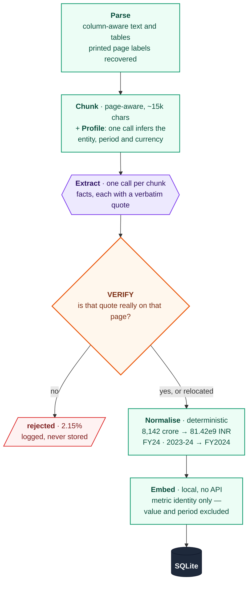
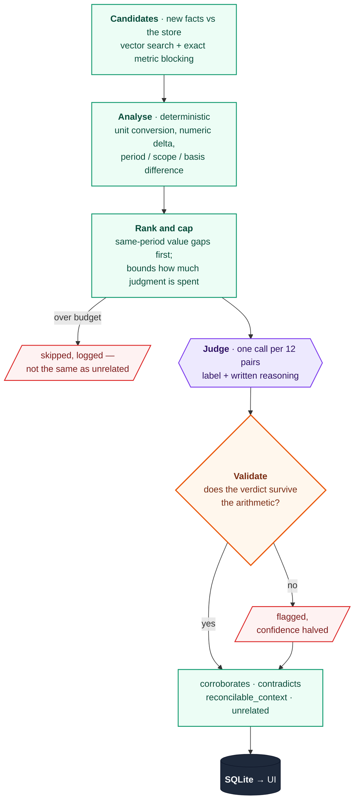

# Fact Knowledge Layer

Extracts checkable facts from PDFs, anchors every one to a verbatim quote in its
source page, and works out how facts from different documents relate: whether
they corroborate each other, genuinely conflict, or only appear to conflict
because they were measured over different periods, in different units, or at
different scopes.

Backend is FastAPI + SQLite, frontend is React + Tailwind, extraction and
reconciliation run on Google Gemini's free tier, and semantic similarity runs
locally on `sentence-transformers` so no tokens are spent finding candidates.

**On the six starter documents: 3,460 facts, every one with a located quote,
1,377 relationships, 279 API calls.**

---

### Where to look

| | |
|---|---|
| **Just run it** | [Setup](#setup-and-run-instructions) — one command, no API key needed to see results |
| **The four required cases** | [Results](#results-on-the-starter-corpus) — corroboration, contradiction, context, failure |
| **How well it works** | [Measured accuracy](#how-accurate-is-it-measured) — recall against hand-labelled facts, and where it fails |
| **How it works** | [Architecture](#architecture) — two diagrams, then the ideas behind them |
| **Why it's built this way** | [Design decisions](#design-decisions-and-trade-offs) and [what went wrong](#things-that-went-wrong-and-what-fixed-them) |
| **What it can't do** | [Limitations](#limitations-and-next-steps) |

The first three take about five minutes. The rest is there if you want the
reasoning behind a particular decision.

---

## Setup and Run Instructions

**Requirements: Python 3.11 or newer. That is the whole list.** Node is not
needed to run this — the built frontend is committed and the backend serves it.

```bash
python run.py
```

Then open **<http://127.0.0.1:8000>**.

That one command creates the virtual environment, installs dependencies (a few
minutes the first time, mostly the CPU build of torch), copies `.env` from the
template, seeds the pre-ingested corpus, and serves the API and UI from a single
process.

**It works immediately with no API key.** A fully ingested corpus is committed
at `samples/facts.db` and copied into place on first run, so every view is
populated from the start: 6 documents, 511 pages, 3,460 facts, 1,377
relationships, and the four demonstration cases.

### To ingest your own PDFs

Extraction needs a Gemini key. The free tier is enough — the entire starter
corpus cost 279 calls.

1. Get a free key at <https://aistudio.google.com/apikey>.
2. Put it in `backend/.env`:

```
GEMINI_API_KEYS=your_key_here
```

3. Restart `python run.py`, then drag a PDF onto the **Ingest** tab.

Several keys can be listed comma-separated; they are rotated and rate-limited
independently, which raises throughput. One key is fine for a document or two.

New documents are added to the existing corpus rather than replacing it, so
uploads are compared against everything already there. `python run.py --fresh`
starts from an empty store instead.

### Other useful entry points

- Raw JSON of every result is in `samples/` — `showcase.json` holds the four
  required cases with their evidence and reasoning, and needs no setup at all.
- Interactive API docs at <http://127.0.0.1:8000/docs>.
- `python run.py --port 9000` to serve elsewhere, `--no-install` to skip the
  dependency check on restarts.
- To work on the UI: `cd frontend && npm install && npm run dev` for a
  hot-reloading build on `:5173` that proxies `/api` to the backend.

### Useful scripts

All run from `backend/`, and all but one cost no API calls.

| Command | What it does |
|---|---|
| `python eval/run_eval.py [--verbose]` | Score the pipeline against hand-labelled facts |
| `python -m pytest` | 258 unit tests |
| `python scripts/diagnose.py` | Corpus-wide quality report |
| `python scripts/peek.py facts\|relations\|issues` | Readable sample of what was extracted |
| `python scripts/debug_reject.py [n]` | Show rejected extractions beside the source text |
| `python scripts/reverify.py` | Re-check every stored quote against a fresh parse |
| `python scripts/plan_ingest.py <dir>` | Report the call budget a corpus needs, before spending it |
| `python scripts/check_keys.py` | Probe every key against the live API (1 call per key) |

Also in `scripts/`: `check_env.py`, `ingest.py`, `export_samples.py`, and
`renormalize.py` / `revalidate.py`, which re-derive comparison keys and replay
the judgment check after a parser fix without re-requesting anything.

---

## Video Demo

**[Demo video (3 minutes or less)](ADD_YOUR_LINK_HERE)**

Shows a PDF being ingested end to end, then each of the four required cases with
its source evidence and the system's reasoning.

---

## Results on the starter corpus

Both starter datasets were ingested into one shared knowledge layer. They cover
unrelated subject areas on purpose: the system had to keep them apart on its own
rather than being told they were separate corpora.

| | |
|---|---|
| Documents / pages | 6 / 511 |
| Facts stored | **3,460** |
| Facts with a located quote | **3,460 (100%)**: 3,413 on the cited page, 47 relocated |
| Facts rejected for unverifiable evidence | 76 (**2.15%** of everything proposed) |
| Relationships | **1,377**: 80 corroborate, 6 contradict, 834 reconcilable-by-context, 457 unrelated |
| Verdicts flagged as inconsistent | 18 (initially 50, see below) |
| LLM calls | **279** (155 extraction, 118 judgment, 6 profile) |
| Wall clock | 37 minutes on 5 free-tier keys |

Normalisation coverage: 98.6% of facts got a parsed numeric value, 92.4% a
canonical period, 100% a measurement basis.

The relation mix is worth reading carefully. Contradictions are rare (6) because
the bar is deliberately high: a difference in numbers is not a contradiction
until period, unit, scale, scope and basis have all been ruled out. Most
apparent conflicts turn out to be reconcilable, and 698 of the 834 reconcilable
pairs differ on time alone.

### The four required cases

All four are computed live from whatever is currently ingested, not hardcoded.
They are the Walkthrough tab in the UI, and `samples/showcase.json` on disk.

**1. Corroborated across documents, stated differently.** Delhivery's FY24
EBITDA appears as `₹127 Cr` in the Q4 earnings deck and `₹1,266 million` in the
annual report. Different documents, different scales, same quantity. The
normaliser converts both to 1.27e9 INR; the judge explains the conversion.

**2. A genuine or likely contradiction.** Growth in emerging markets for CY2025
is stated as `4.3%` in Delhivery's annual report and `3.7%` in the RBI annual
report. Both are projections, for the same period, about the same subject. They
cannot both be right, and they trace to different IMF forecast vintages.

**3. An apparent contradiction explained by context.** The Economic Survey
reports Kharif food-grain production growth as both `8.2%` and `5.7%` for
2024-25. Not a conflict: one is measured against the five-year average, the
other against the previous year. Labelled `reconcilable_context`, dimension
`scope`. A second example differs on `basis`: an RBI inflation projection for
FY25 appears as both `4.5%` and `4.8%` because the December 2024 MPC revised it.

A third is non-numeric, and is the brief's own illustration of a director active
in one document and gone from a later one. The prospectus states `5`
Non-Executive Independent Directors as on 14 May 2022; the FY24 annual report
states `6` as on 31 March 2024. Dimension `time`, confidence 1.00, reconciled as
*"the figures refer to different points in time"* — the board changed between
the filings. Nothing about this pair is financial, and no rule anywhere names
directors: it works because a fact is `subject · predicate · value · period`
whatever the subject happens to be. The same mechanism corroborates
`19/08/2021` against `August 19, 2021` for a director's appointment date, which
is the brief's differently-written-addresses case in another costume.

**4. An extraction or reasoning failure.** Three distinct kinds, all surfaced in
the UI rather than swallowed: 76 facts rejected because their quote could not be
found in the source, 47 citations automatically repaired, and 18 verdicts
flagged where the model's label contradicted the deterministic analysis. The
"Things that went wrong" section below describes each and what fixed it.

### How accurate is it, measured

```bash
cd backend && python eval/run_eval.py
```

Three questions, answered separately because they fail for different reasons.
No API calls, and no model scores the system — a scoring function that calls the
thing under test is not a measurement.

**Is every fact anchored to evidence, and does it carry the number its own quote
carries?** Both run over the whole corpus and need no ground truth, so they are
properties the system can be held to on any PDF, not just these six.

| | |
|---|---|
| Quote located in the source | **3,460 / 3,460 — 100%** |
| Value present in its own quote | **3,399 / 3,411 — 99.65%** |

The second is the stricter test: a quote that verified against the page still
says nothing about whether the value attached to it came from that quote. All
twelve exceptions are printed in full by the harness, because they are worth
reading rather than assuming wrong. Most are the model resolving a number the
sentence states in words (`"No meetings ... were held during FY24"` → `0`) or
reading a value off a chart and citing its axis label — correct facts with a
weak evidence link, which is a different failure from hallucination.

**Does it find what a human reading the page would write down?** This needs
ground truth, so it is necessarily small: 30 facts in
[`eval/labeled_facts.json`](backend/eval/labeled_facts.json), read off the
source pages before looking at any output, spread across all six documents and
graded easy/medium/hard up front.

| | | |
|---|---|---|
| Found, on the labelled page | **20/30** | 66.7% |
| Same fact, elsewhere in the document | 3/30 | 10.0% |
| Number present under a name the rule didn't match | 1/30 | 3.3% |
| Not in the knowledge layer at all | 6/30 | 20.0% |
| Normalised value correct, of those found | **20/20** | 100% |
| Period key exactly right, of those found | 11/16 | 68.8% |

By difficulty: 6/6 easy, 7/10 medium, 7/14 hard. Converting units is not the
weak half — finding facts is. The hard ones are wide projection tables where the
wanted figure is the fourth of ten columns, and monthly series where it is the
last of thirteen; the system takes the first column and stops.

All five period mismatches share one root cause — the instant-versus-fiscal-year
case described under [what went
wrong](#things-that-went-wrong-and-what-fixed-them), which `compare_periods`
already reconciles downstream via its `aligned` state. The eval measures strict
key equality and counts it wrong anyway: the harness being stricter than the
design, reported rather than tuned away.

Recall is reported alone rather than folded into an F1, because dividing a
recall over thirty labels by a precision over thousands yields a number that
looks authoritative and means very little.

The harness caught a bug in itself: an earlier version let an exchange rate of
₹85.62 satisfy a label asking for ₹85.6 — two readings six months apart — and
scored itself higher for it. Tolerance cannot separate those without also
rejecting ₹127 Cr matching ₹1,266.41 million, so the fix was requiring the match
to sit on the labelled page. Reported recall fell from 76.7% to 66.7%.

---

## Approach

### Architecture

Two phases. The first turns one document into verified facts; the second
compares those facts against everything already stored.

Purple is an LLM call — the only step that costs quota. Green is deterministic
Python: free, auditable, and identical on every run. Orange is a gate that can
reject its input, and red is what gets thrown away and logged rather than
silently kept.

**1. Ingesting one document**



**2. Linking against everything already known**

Only the new document's facts run through this. Existing facts are already
parsed, extracted and embedded, which is what makes ingestion incremental.



### Module map

The four worth opening first:

| Path | Responsibility |
|---|---|
| `app/pipeline/verify.py` | Quote matching — the evidence guarantee |
| `app/pipeline/normalize.py` | Units, scales, periods, metric identity |
| `app/pipeline/linking.py` | Candidates, analysis, judgment, validation |
| `app/llm/prompts.py` | The three prompts: profile, extract, judge |

The rest: `pdf_parse.py` and `chunking.py` turn PDFs into page-marked text,
`extract.py` and `ingest.py` orchestrate a document through the pipeline,
`embeddings.py` holds the local encoder and vector index, `llm/keypool.py` and
`llm/gemini.py` the key rotation and circuit breaker, `showcase.py` the four
demonstration cases as live queries, and `config.py` every tunable in one place.
`schema.sql` documents the reasoning behind each table.

The frontend mirrors this: `ShowcaseView` is the four-case walkthrough,
`RelationsView` the relationship browser, `FactsView` the searchable fact list
with an evidence drawer that highlights the quote inside its source page, and
`IngestView` upload plus live progress and key-pool telemetry.

### The ideas that matter

**1. A citation is only a citation if it survives a click.** Before storage,
every quote is searched for in the actual text of the page it claims. Matching
tolerates the whitespace and punctuation damage PDF extraction always produces,
and nothing else. Three outcomes: `verified`, `relocated` (found on a different
page, citation corrected and logged), and `unverified` — where **the fact is
rejected**. A model that paraphrases, merges two sentences, or invents a number
does not clear this bar, and there are tests asserting exactly that.

**2. Deterministic normalisation, not prompt arithmetic.** The model reads the
document; Python does the maths. `8,142` + `INR crore` becomes `81.42e9 INR`;
`FY24`, `FY 2023-24` and `2023-24` all become `FY2024`; `25 bps` becomes
`0.25 pp`; `(1,008)` becomes `-1008`. Auditable, free, and it hands the judge a
finished comparison rather than asking a language model to do arithmetic.

**3. Embed the metric, not the measurement.** The embedded text is subject,
predicate and scope qualifiers, with value and period deliberately excluded.
This is counter-intuitive and load-bearing: if the value were embedded, two
documents that disagree would be pushed *apart* in vector space and the
disagreement would never be found. Excluding the period is a bonus — `revenue
FY2024` and `revenue FY2023` embed identically, pair up, and get labelled
reconcilable-by-time. Period markers are stripped from metric names too, because
models write `FY24 EBITDA` in one document and `EBITDA` in another.

**4. Judgment is the scarce resource, so it is rationed by expected value.**
Candidate pairs grow roughly quadratically — on the largest document, 1,072
candidates, 311 rejected by rule, the top 420 judged, 341 skipped.
`linking.priority` ranks same-period value gaps (the contradiction signature)
highest, then near-misses, then scale differences, then agreement stated
differently; identical agreement ranks lowest. The skipped count is logged: a
pair that was never judged is not a pair that was judged unrelated.

**5. The model's verdict is checked against the arithmetic.** The judge sees each
fact's evidence quote, and quotes routinely mention other years and figures — it
once called a 6.6%/2023 fact and a 5.7%/2024 fact identical because both quotes
contained "5.7 per cent in 2024". The deterministic layer only ever sees
normalised values and periods, so it cannot be misled that way. A corroboration
across different periods, or a contradiction between an estimate and an actual,
is inconsistent by construction; such verdicts are kept, halved in confidence,
marked `llm-flagged` and logged.

**6. Incremental by construction.** Ingesting document N never re-parses,
re-extracts or re-embeds documents 1..N-1. The only new work is this document's
extraction plus the comparisons it newly makes possible. Deleting a document
cascades to its facts, embeddings and exactly the relations that referenced them.

### Why the similarity threshold is 0.58

From the judged pairs, grouped by the cosine score that made them candidates:

| Similarity band | Pairs | Judged `unrelated` |
|---|---|---|
| 0.95 - 1.00 | 825 | 18.3% |
| 0.85 - 0.95 | 197 | 24.9% |
| 0.75 - 0.85 | 163 | 56.4% |
| 0.65 - 0.75 | 147 | 83.7% |
| 0.58 - 0.65 | 45 | 93.3% |

A clean monotonic curve, so the threshold is a data-backed dial rather than a
guess: raising it saves budget and costs recall. Note that even at 0.95+, 18% are
unrelated. That is the direct consequence of embedding metric identity while
excluding values and periods, and it means the judge is doing real work.

### Generalising to unseen PDFs

The following appear nowhere in the codebase: document filenames, titles or
publishers; metric names, expected facts, or per-document schemas; layout rules
keyed to a particular report.

What is imposed instead is the universal shape of a measurement — who, what, how
much, when, under what scope — plus a model-authored, open-ended `qualifiers`
list carrying whatever document-specific nuance exists, in the document's own
words. That is also how the schema evolves as new kinds of fact appear.

Everything else is driven by structure, not content: character counts drive
chunking, block geometry drives column detection, regexes over units and periods
drive normalisation, and the four demonstration cases are queries over live
data. Ingest a corpus about shipping or pharmaceuticals and the same queries
surface that corpus's examples.

The two lookup tables that *are* content — currencies and period phrasings —
were widened past the starter corpus and tested there, since the brief warns
that other PDFs may be used. 30-plus currencies resolve by ISO code, symbol or
qualified name (`A$` and `Australian dollar` reach AUD without the bare `$` or
`dollar` catching them first), and calendar-year filings normalise correctly:
`year ended December 31, 2023` becomes `CY2023`, not a fiscal year. Ambiguous
English words are deliberately excluded — `won`, `real`, `rand` and `peso` are
absent, because a false currency match would silently make two unrelated figures
look comparable, which is worse than not matching at all. There are tests
asserting that `audited` is not read as Australian dollars.

### Design decisions and trade-offs

**SQLite over Postgres.** Single-node system, thousands of rows. It gives
transactions, joins, foreign-key cascades and a single-file artifact that can be
committed and handed to a reviewer, at zero operational cost — the whole corpus
is 12.3 MB including 511 pages of source text. It would need replacing for
concurrent writers, or a corpus large enough that a brute-force vector scan
stops being instant.

**Brute-force vectors over a vector database.** Vectors are L2-normalised, so
cosine similarity is one NumPy dot product over 3,460 × 384 — sub-millisecond,
faster than the network round trip to any vector service. The index is a class
with `load`/`add`/`search`, so swapping it is contained.

**A small embedding model.** Facts are one-line claims, and similarity is used
only for *recall* — deciding which pairs are worth looking at. The decision is
made downstream by rules plus the judge, so a larger encoder would be optimising
the wrong stage.

**Raw REST over the `google-genai` SDK.** The SDK binds a key at client
construction, so a rotating pool would mean rebuilding clients per call and
losing connection pooling. Direct calls give exact control over which key is
attached to which request, plus access to the `RetryInfo` payload in 429s that
drives cooldowns.

**Three model tiers, matched to three difficulties**, and chosen by measurement
rather than preference. Extraction is high-volume and mechanical (~90% of all
calls) so it runs on a fast non-thinking model. Routine judgment runs on a
reliable lite model. A thinking model is reserved for the hardest pairs: same
period, values that disagree, nothing obvious to explain it. On a five-way burst
test the newest flash model returned 429/503 on 5 of 5; the lite model answered
5 of 5 but got a basis-difference case wrong once; `gemini-3.5-flash` answered
5 of 5 correctly every time — but its free *daily* allowance cannot cover a whole
corpus, so it is spent only where it changes the answer.

**A circuit breaker at the model level, not just the key.** Two failure modes
share HTTP 429: a per-minute rate limit is the key's problem and clears in
seconds, while an exhausted daily allowance is the *model's*, and parking a key
for it would wrongly shrink the pool for every other model. Measured, not
hypothesised — when the thinking model's quota ran out, judgment calls averaged
4.01 attempts and 64.5 seconds against extraction's 1.01. `_ModelHealth` now
skips a model once two distinct keys have been refused.

**~15k character chunks.** The context window is far larger than anything sent,
so the trade-off is recall, not capacity: a bigger chunk costs fewer calls but
asks the model to notice every fact across more text. Citation precision is
unaffected either way, because page markers travel inside the chunk and every
quote is verified afterwards. This is the main quota dial.

**PyMuPDF over pdfplumber** for the main text pass — roughly an order of
magnitude faster on 100-page filings, though its reading-order default had to be
replaced; see below. **Judgment is batched** twelve pairs to a call, so a
thousand candidates cost 84 calls rather than a thousand.

### Things that went wrong, and what fixed them

Each was found by measurement during the build, and each is locked down by a
regression test.

**Two-column layouts were shredding sentences.** PyMuPDF's reading-order sort
interleaves the columns of a two-column page line by line, so a left-column
sentence is stored with fragments of the right column wedged into it. The model
read those pages correctly and quoted them correctly, and the verifier then
rejected **394 correct facts** because the quote was not contiguous in the
stored text. Institutional reports are overwhelmingly two-column, so this
decided whether those documents were usable at all. Replaced with
block-geometry column detection, validated by re-checking every already-stored
quote: **350 of 394 rejections recovered, 18 of 1,352 verified facts
regressed.** Corpus-wide, rejections fell from 394 to 76.

**Wide landscape pages were almost entirely whitespace.** One page extracted to
145,352 characters, of which about 6,600 were content — that page alone would
have cost sixteen extraction calls. Capping space runs cut the corpus from 751
to 456 chunks, 39%, with no digits lost.

**`March 31, 2024` was parsed as the year 2031.** The month-year rule matched
before the full-date rule and read the day as a two-digit year, mis-dating 447
facts — 14% of the corpus — because that is how every Indian balance-sheet line
states its date.

**Table columns extracted without their discriminator.** Two cells from one row
arrived with identical subject, predicate and period and nothing to tell them
apart. The prompt now requires the column header in `qualifiers` whenever a row
carries multiple value columns.

**Then the consistency check caught a bug in the checker, not the model.** Of
the 50 verdicts it flagged, 46 were the model being right and the normaliser
being wrong. `"for the year ended March 31, 2024"` denotes a whole fiscal year
but was collapsed to an instant, making a year's EBITDA incomparable with the
same figure written `FY24` — 158 facts affected. And because such tables are
*headed* "for the year ended..." while the model timestamps rows with the bare
date, an instant legitimately sits on a fiscal-year boundary; a third comparison
state, `aligned`, now covers that, kept distinct from `same` because a stock
measured *at* a date and a flow measured *over* the year ending on it genuinely
differ.

**Flagged verdicts fell from 50 to 18 with zero API calls**, via
`scripts/renormalize.py --apply` then `scripts/revalidate.py --apply`. That is
the separation of extraction from normalisation paying for itself: the model's
raw output never had to be re-requested. Most of the remaining 18 are correct
flags — the judge called RBI's policy rate of 5.5% (June 2025) and 6.0% (April
2025) a contradiction, when it is a rate cut between two months.

### Brownie points

All four suggested extensions are implemented.

- **Large PDFs.** Page-aware chunking, bounded concurrency, per-chunk failure
  isolation, and the whitespace fix that cut the corpus 39%. Largest document:
  100 pages, 1,233 facts.
- **Many PDFs in one layer.** Six documents from two unrelated domains share one
  store; 1,159 of the 1,377 relationships are cross-document.
- **A dynamically evolving schema.** Model-authored `fact_type` and open-ended
  `qualifiers` rather than a fixed column set, so a new kind of fact needs no
  migration.
- **Incremental ingestion.** Guaranteed by construction and foreign-key
  cascades, not by convention.

### AI tools used

The brief permits coding agents and asks that their use be disclosed, so here is
the split, honestly.

**Mine.** The stack and the pipeline design: page-aware chunking that preserves
page numbers for citation, per-chunk extraction into a loose fact record,
embedding each fact and vector-searching for near-duplicates, then a second LLM
call to judge how a pair relates. Also the decisions to rotate a pool of
free-tier keys, to embed locally so candidate search costs no tokens, to make
ingestion incremental, and to surface a failure case deliberately. Then the
direction during the build — dropping the deployment work once it proved
overkill, and pushing for the security audit that found API keys leaking into a
database about to be committed.

**Claude Code (Opus 5).** Implementation, the 258 tests, and the debugging
behind the fixes above. It also contributed design that was not in my brief: the
quote-verification gate, the deterministic normalisation layer, the
document-profile pass, the priority ranking that rations judgment calls, and the
validator that cross-checks each verdict against the arithmetic.

**At runtime**, the system uses Google Gemini — `gemini-3.5-flash-lite` for
extraction and profiling, `gemini-3.1-flash-lite` for routine judgment,
`gemini-3.5-flash` for escalated contradiction candidates — and
`sentence-transformers` (`all-MiniLM-L6-v2`) locally for candidate retrieval.

---

## Limitations and Next Steps

**Scanned PDFs are not handled.** A document with no text layer yields nothing
but a logged `no_text_layer` warning. An OCR pass would complete the ingest path.

**Fiscal-year convention is assumed: April to March.** Correct for every
document here, and the exposure elsewhere is narrower than it sounds, so it is
worth being exact about where it breaks.

| Phrasing | Normalises to | |
|---|---|---|
| `year ended December 31, 2023` | `CY2023` | correct — calendar-year filers are fine |
| `as of September 30, 2024` | `@2024-09-30` | correct — dated instants carry no convention |
| `the three months ended June 30, 2024` | `3M@2024-06-30` | correct |
| `2022/23`, `FY24` | `FY2023`, `FY2024` | correct on the April–March convention |
| `year ended 30 June 2024` | `FY2025` | **wrong** for an Australian filer; should be FY2024 |
| `fiscal year ending September 30, 2024` | `FY2025` | **wrong** for a US federal report |

So the break is confined to documents whose fiscal year ends in neither March
nor December *and* which label it with an `FY`-style token. Most US and European
filings state calendar year-ends and pass through correctly. When it does break
it mis-labels the period by one year — the fact, its value and its evidence are
all still right, but it would be compared against the wrong year.

`normalize.FY_START_MONTH` is a single constant rather than logic spread through
the code, and the profile pass already reads front matter, so inferring it per
document is the obvious fix. It is not done here because it would change an
LLM-facing schema that cannot be tested without a foreign-convention PDF to test
it against.

**Some period phrasings still fall through.** Abbreviated forms with an
apostrophe (`Mar '23`) do not parse, leaving those facts without a period key. An
instant falling inside a stated month (`@2024-09-13` against `2024-09`) is
treated as a different period rather than an aligned one, which flags a small
number of correct corroborations.

**Rejected facts are discarded, not repaired.** A fact whose quote cannot be
located is dropped. A cheap second pass could hand the model back its own
proposal plus the page text and ask it to point at the exact span, recovering
facts that are real but poorly quoted.

**Table extraction is line-based, not cell-based** — the largest surviving
failure mode, and it shows up twice. Most remaining rejections trace to wide
tables whose rows are re-flowed during extraction. And the eval's clearest
finding: wide tables get read left-to-right and abandoned, so on a ten-column
IMF projection row (`External debt ... 619.1 623.9 668.8 736.3 ...`) the
pipeline takes the 2021/22 figure and never reaches 2024/25, the same on a
thirteen-month RBI series where the wanted value is last. That is five of the
six outright misses in the labelled set. Without cell structure the model has no
reliable way to pair a value with its column header; feeding it a structured
table representation and matching quotes against cells would fix both.

**The relationship graph is a ranked subset, not exhaustive.** Bounded by
`MAX_PAIRS_PER_INGEST`. The count of skipped pairs is recorded, but a pair that
was never judged is not a pair that was judged unrelated.

**Flagged verdicts are not re-adjudicated.** Inconsistent judgments have their
confidence halved and are logged, but nothing re-examines them. A second opinion
from a stronger model, or a self-consistency vote, would close the loop.

**Confidence scores are model self-reports.** Useful for ranking; not calibrated
probabilities.

**No authentication.** It binds to localhost and is a local tool. Anything
multi-user needs auth, per-user quotas and upload limits.

**What I would build next, in order:** cell-level table extraction (biggest
quality win), the re-ask pass for rejected quotes (cheap recall win), per-document
fiscal-year inference, then OCR.

---

## Additional Notes

### Testing

```bash
cd backend && python -m pytest
```

258 tests, covering the logic where mistakes are silent and expensive: unit and
scale conversion, fiscal-versus-calendar period parsing, quote matching against
deliberately hallucinated and paraphrased quotes, truncated-JSON recovery, metric
identity across period labels, the candidate priority ranking, escalation
routing, the model circuit breaker, and the judgment consistency guard. Cases
taken from real failures on the starter corpus are marked as such in the
docstrings.

The evaluation harness is tested too, since a scorer that is too generous
inflates the result it reports. One test exists purely to document a limit: the
value rule cannot separate two readings 0.02% apart, and rejecting those is the
page rule's job.

`scripts/reverify.py` is the integration-level check — it re-parses every
ingested PDF and re-tests every stored quote, so a change to PDF handling can be
measured rather than guessed at.

### Handling of failure, by design

Everything rejected, repaired, flagged or skipped is a row in the `issues` table
and visible in the UI:

| Kind | Meaning |
|---|---|
| `quote_not_found` | Evidence could not be located; fact rejected |
| `quote_relocated` | Quote found on a different page; citation corrected |
| `judgment_inconsistent` | Model verdict contradicted the deterministic analysis |
| `pairs_over_budget` | Candidate pairs skipped to stay within quota |
| `incomplete_fact` | Required field missing; fact dropped |
| `chunk_failed` / `judge_failed` | All retries exhausted for one unit of work |
| `no_text_layer` | PDF has no extractable text |
| `profile_failed` | Document context could not be inferred |

### API

| Method | Path | Purpose |
|---|---|---|
| `GET` | `/api/health` | Key pool status, models, daily budget remaining |
| `GET` | `/api/keys` | Per-key load, cooldowns, models in cooldown (masked) |
| `GET` | `/api/stats` | Corpus counts, relation mix, call telemetry |
| `POST` | `/api/documents` | Upload PDFs; returns job ids |
| `GET` | `/api/documents` | List documents with fact and issue counts |
| `GET` | `/api/documents/{id}` | Detail, including the inferred document profile |
| `DELETE` | `/api/documents/{id}` | Remove a document and everything derived from it |
| `GET` | `/api/documents/{id}/pages/{n}` | Raw page text, for the evidence viewer |
| `GET` | `/api/jobs/{id}` | Ingestion progress |
| `GET` | `/api/facts` | Search and filter facts |
| `GET` | `/api/facts/{id}` | Fact with evidence, page context and relationships |
| `GET` | `/api/relations` | Filter relationships by type and confidence |
| `GET` | `/api/showcase` | The four demonstration cases |
| `GET` | `/api/issues` | Everything rejected, repaired or flagged |

Interactive docs at <http://localhost:8000/docs>.

### Why there is no hosted URL

Deliberate, and measured rather than assumed. `python run.py` satisfies the
brief in one command, with no key needed to see results. Every free option
failed on a checkable constraint: Vercel's 250 MB bundle limit against a
1,085 MB install (torch alone is 502 MB), plus minutes-long ingestion against a
seconds-long request timeout; Hugging Face Docker and Gradio Spaces now require
a paid plan; Render and Koyeb's 512 MB tiers against a measured 476 MB peak for
embedding alone; Cloud Run requires billing enabled.

Two ways to shrink it were tested and rejected on evidence. Gemini's embedding
endpoint exhausted all five keys after **800 items**, against a corpus of 3,460
— on this tier, API-based embedding is not merely more expensive, it is not
possible, which is the strongest argument for embedding locally. ONNX produced
interchangeable vectors (cosine **1.0000** over 120 real claims, identical
candidate decisions at every threshold) and cut the install to 180 MB, but peak
memory measured **1,034 MB versus torch's 476 MB** — it solves disk and makes
RAM worse.

What was kept: the backend serves the built frontend, so the app is one process
on one port with no Node. `MAX_UPLOAD_MB`, `MAX_PAGES_PER_UPLOAD` and
`DEMO_MODE` remain for anyone who does want to expose an instance.

### Security

Three things here are untrusted: the API keys, the PDFs, and the callers.

**Credentials.** `backend/.env` is gitignored and no key is committed — verified
by scanning every tracked file *and* the bytes of the committed database. Keys
are masked wherever they surface, and the pool stores only a key *index*.

One real leak was found and closed. The key travels as a query parameter, so an
httpx transport error can carry the full request URL in its string form — and
that string was written to `llm_calls.error`, in a database this repo commits.
Nothing had actually leaked, because the errors encountered did not embed a URL,
but that is luck rather than design. `gemini.redact()` now runs at every sink
that logs or persists an exception.

**Prompt injection.** The structural defences do most of the work and are not
bypassable by text: a fact is stored only if its quote is found in the real
page, and relation labels come from a fixed whitelist, so an injected
instruction cannot fabricate a citation or invent a relationship.

The gap that *was* exploitable: fixed prompt delimiters. A PDF containing
`--- END TEXT ---` could close the data block early and have everything after it
read as instructions. The document is now fenced with a **per-request random
token** that a document authored beforehand cannot guess, delimiter-shaped
sequences are defanged, and suspected injection is logged with the facts'
confidence halved. `samples/adversarial-injection-test.pdf` is the PDF this was
tested with: the attack failed completely, and its nine legitimate facts were
still extracted and verified.

**Uploads and callers.** Files are checked for `%PDF` magic bytes, not just the
extension, and stored under a generated id so an uploaded name never becomes a
path. `MAX_UPLOAD_MB`, `MAX_PAGES_PER_UPLOAD` (checked *before* PyMuPDF walks
the file) and `MAX_DOCUMENT_CHARS` bound parsing; `RATE_LIMIT_PER_MINUTE` and
`DAILY_CALL_BUDGET` bound what a runaway script costs. `API_TOKEN` enables
bearer auth on mutating endpoints, unset by default because the app binds to
localhost. Every user-supplied value reaches SQLite as a bound parameter.

**What remains open.** Injection defence is mitigation, not proof — a clever
document could still bias *which* facts get extracted, even though it cannot
forge their evidence. Parsing would be better in a subprocess with a memory
ceiling than behind size caps, and the rate limiter is in-memory, so it would
not survive multiple workers.

### A note on the corpus

The assignment supplied two starter datasets of three PDFs each. Both were
ingested into one knowledge layer rather than kept separate, because a system
that only works when you tell it which documents belong together is not really
doing the job. 1,159 of 1,377 relationships are cross-document, and the system
correctly labels the Delhivery/macroeconomy cross-pairs as unrelated except where
they genuinely overlap, such as both citing IMF world growth projections.
